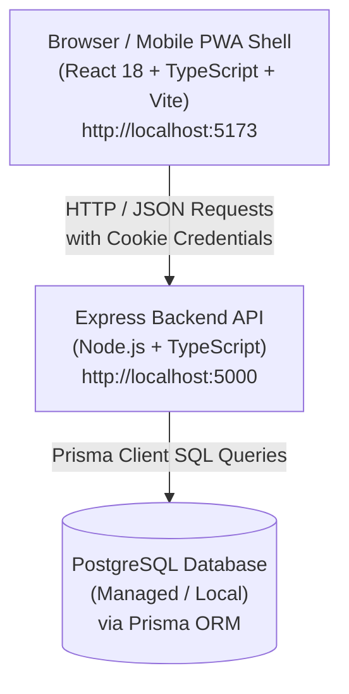
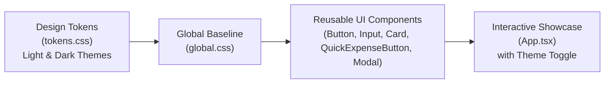

# Pocket Pulse 💳⚡

Pocket Pulse is a production-grade personal expense tracker engineered for speed and simplicity. The core principle is that **recording an expense should take under 2 seconds** via one-tap "Quick Expense" buttons.

---

## 🏗️ Architecture Overview

Pocket Pulse is built as a **Modular Monolith** with a decoupled frontend and backend.



---

## 🎨 Phase 2 Design System Architecture

Phase 2 introduces a flexible, dual-theme Design System built with semantic CSS custom properties (design tokens).



---

## 📁 Repository Structure

```text
pocket-pulse/
├── AGENTS.md                # AI agent instructions & architectural guidelines
├── README.md                # Project documentation & beginner's guide
├── .gitignore               # Root git ignore (protects .env & node_modules)
├── .prettierrc              # Shared code formatting configuration
├── frontend/                # React Single Page Application (SPA)
│   ├── .env.example         # Environment template for frontend
│   ├── src/
│   │   ├── styles/
│   │   │   ├── tokens.css   # Light & Dark design tokens (semantic variables)
│   │   │   └── global.css   # Global CSS reset & base element styling
│   │   ├── components/ui/
│   │   │   ├── Button.tsx & .css        # Button with variants, sizes & spinner
│   │   │   ├── Input.tsx & .css         # Form input with label & error handling
│   │   │   ├── Card.tsx & .css          # Bordered, elevated & interactive cards
│   │   │   ├── QuickExpenseButton.tsx & .css # 1-tap <2s quick expense button
│   │   │   └── Modal.tsx & .css         # Accessible modal / bottom sheet
│   │   ├── App.tsx          # Phase 2 Design System Interactive Showcase
│   │   └── main.tsx         # Entry point mounting React to DOM
│   ├── package.json         # Frontend dependencies (React, Vite, TypeScript)
│   └── vite.config.ts       # Vite build tool configuration
└── backend/                 # Node.js + Express REST API Server
    ├── .env.example         # Environment template for backend
    ├── prisma/
    │   └── schema.prisma    # Database schema configuration (PostgreSQL)
    ├── src/
    │   ├── app.ts           # Express application & middleware setup
    │   ├── server.ts        # Server entry point listening on PORT 5000
    │   ├── config/
    │   │   └── db.ts        # Prisma DB client setup & health check
    │   └── routes/
    │       └── health.ts    # GET /api/v1/health status endpoint
    ├── package.json         # Backend dependencies (Express, Prisma, CORS)
    └── tsconfig.json        # TypeScript compiler settings for Node.js
```

---

## 🧠 What Exists in Phase 2 & Why

### 1. Dual-Theme Semantic Design Tokens (`tokens.css`)
* **Why**: Both Light and Dark themes are intentionally crafted using semantic CSS variables (`--color-bg-app`, `--color-text-primary`, `--color-brand-primary`, etc.). Theme switching is controlled via `data-theme="light"` or `data-theme="dark"` on `<html>` with fallback to `prefers-color-scheme`.

### 2. Core UI Components (`frontend/src/components/ui/`)
* **Button (`Button.tsx`)**: Supports `primary`, `secondary`, `ghost`, and `danger` variants, size scale (`sm`, `md`, `lg`), `fullWidth`, and accessible loading spinner.
* **Input (`Input.tsx`)**: Accessible text/number input supporting labels, helper text, and error states with focus rings.
* **Card (`Card.tsx`)**: Flexible surface container supporting `flat`, `bordered`, and `elevated` variants, plus interactive hover states.
* **QuickExpenseButton (`QuickExpenseButton.tsx`)**: Engineered specifically for Pocket Pulse's core principle of recording an expense in under 2 seconds. Features emoji icon, preset amount in INR/paise, category label, and active tap feedback.
* **Modal (`Modal.tsx`)**: Accessible modal dialog / mobile bottom-sheet with backdrop blur, keyboard ESC dismissal, and scroll lock.

---

## 🚀 How to Run & Verify Phase 2 Locally

### 1. Run Frontend Design System Showcase
1. Open a terminal and navigate to `frontend/`:
   ```bash
   cd frontend
   npm run dev
   ```
2. Open `http://localhost:5173` in your browser.
3. Test the interactive theme switcher toggle (`☀️ Light Mode` / `🌙 Dark Mode`).
4. Test clicking the **Quick Expense Buttons** to launch the interactive modal.

### 2. Run Typechecking & Build Verification
```bash
cd frontend
npm run build
```

---

## 🛠️ Dev Scripts Summary

| Workspace | Command | Description |
| :--- | :--- | :--- |
| `backend/` | `npm run dev` | Starts server with live auto-reload using `tsx` |
| `backend/` | `npm run typecheck` | Checks TypeScript compilation without outputting files |
| `backend/` | `npm run db:generate` | Generates Prisma TypeScript client |
| `frontend/` | `npm run dev` | Starts Vite local dev server |
| `frontend/` | `npm run build` | Builds production bundle |
