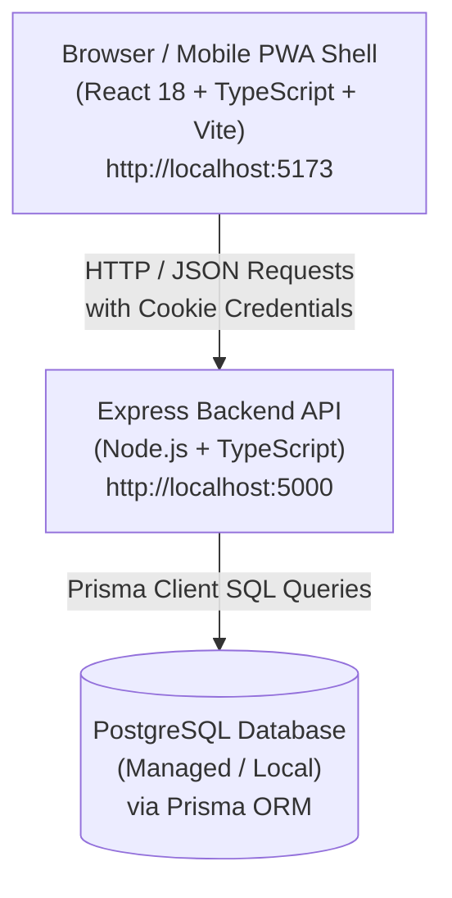

# Pocket Pulse 💳⚡

Pocket Pulse is a production-grade personal expense tracker engineered for speed and simplicity. The core principle is that **recording an expense should take under 2 seconds** via one-tap "Quick Expense" buttons.

---

## 🏗️ Architecture Overview

Pocket Pulse is built as a **Modular Monolith** with a decoupled frontend and backend.



---

## 📁 Repository Structure

```text
pocket-pulse/
├── AGENTS.md                # AI agent instructions & architectural guidelines
├── README.md                # Project documentation & beginner's guide
├── .gitignore               # Root git ignore (protects .env & node_modules)
├── .prettierrc              # Shared code formatting configuration
├── frontend/                # React Single Page Application (SPA)
│   ├── .env.example         # Environment template for frontend
│   ├── src/
│   │   ├── App.tsx          # Baseline React app shell
│   │   └── main.tsx         # Entry point mounting React to DOM
│   ├── package.json         # Frontend dependencies (React, Vite, TypeScript)
│   └── vite.config.ts       # Vite build tool configuration
└── backend/                 # Node.js + Express REST API Server
    ├── .env.example         # Environment template for backend
    ├── prisma/
    │   └── schema.prisma    # Database schema configuration (PostgreSQL)
    ├── src/
    │   ├── app.ts           # Express application & middleware setup
    │   ├── server.ts        # Server entry point listening on PORT 5000
    │   ├── config/
    │   │   └── db.ts        # Prisma DB client setup & health check
    │   └── routes/
    │       └── health.ts    # GET /api/v1/health status endpoint
    ├── package.json         # Backend dependencies (Express, Prisma, CORS)
    └── tsconfig.json        # TypeScript compiler settings for Node.js
```

---

## 🧠 What Exists in Phase 1 & Why

### 1. Root `.gitignore` (Security First)
* **Why**: Prevents secret environment variables (`.env`) and heavy binary folders (`node_modules/`, `dist/`) from ever being committed to GitHub.

### 2. Frontend Scaffolding (`frontend/`)
* **Technology**: React + TypeScript + Vite.
* **Why Vite**: Vite is significantly faster than legacy build tools like Create React App. It provides instant hot-module reloading during development.

### 3. Backend Scaffolding (`backend/`)
* **Technology**: Node.js + Express + TypeScript + Prisma ORM.
* **Why Express**: Lightweight, battle-tested HTTP framework ideal for REST APIs.
* **Why Prisma**: Provides TypeScript types directly generated from the database schema, preventing SQL typos and runtime schema bugs.

### 4. Health Check API (`GET /api/v1/health`)
* **Endpoint**: `http://localhost:5000/api/v1/health`
* **Why**: Serves as a baseline health verification to confirm that the server is alive, measuring server uptime and database connectivity status.

```json
{
  "status": "ok",
  "service": "Pocket Pulse API",
  "version": "1.0.0",
  "timestamp": "2026-08-18T13:41:08.658Z",
  "uptimeSeconds": 7,
  "database": {
    "connected": false,
    "status": "disconnected (PostgreSQL container pending setup)"
  }
}
```

---

## 🚀 How to Run Locally

### Prerequisites
* **Node.js**: v18+ or v20+ installed
* **npm**: v9+ or v10+

### 1. Setup Backend
1. Open a terminal and navigate to the backend directory:
   ```bash
   cd backend
   ```
2. Install dependencies:
   ```bash
   npm install
   ```
3. Create your local `.env` file from `.env.example`:
   ```bash
   cp .env.example .env
   ```
4. Start the backend development server:
   ```bash
   npm run dev
   ```
   The backend will run at `http://localhost:5000`.

### 2. Setup Frontend
1. Open a new terminal and navigate to the frontend directory:
   ```bash
   cd frontend
   ```
2. Install dependencies:
   ```bash
   npm install
   ```
3. Create your local `.env` file from `.env.example`:
   ```bash
   cp .env.example .env
   ```
4. Start the frontend development server:
   ```bash
   npm run dev
   ```
   The frontend will run at `http://localhost:5173`.

---

## 🛠️ Dev Scripts Summary

| Workspace | Command | Description |
| :--- | :--- | :--- |
| `backend/` | `npm run dev` | Starts server with live auto-reload using `tsx` |
| `backend/` | `npm run typecheck` | Checks TypeScript compilation without outputting files |
| `backend/` | `npm run db:generate` | Generates Prisma TypeScript client |
| `frontend/` | `npm run dev` | Starts Vite local dev server |
| `frontend/` | `npm run build` | Builds production bundle |
